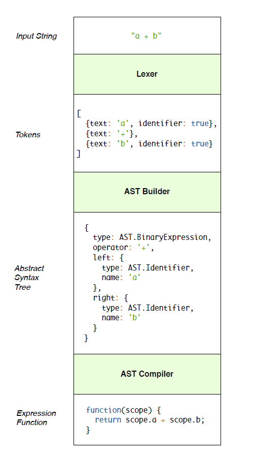

# expression

如上图所示， Angular表达式系统由三部分组成
1. Lexer constructor function负责执行符号化，它有一个lex函数
<pre><code>
function Lexer() {
}
Lexer.prototype.lex = function(text) {
// Tokenization will be done here
};
</code></pre>

2. AST Builder
它接收一个Lexer作为参数，包含一个ast方法用于生成抽象语法树。
<pre><code>
function AST(lexer) {
this.lexer = lexer;
}
AST.prototype.ast = function(text) {
this.tokens = this.lexer.lex(text);
// AST building will be done here
};
</code></pre>

3. ASTCompiler
它接收一个AST Builder，包含一个compile函数，将一个表达式编译成为函数表达式。
<pre><code>
function ASTCompiler(astBuilder) {
this.astBuilder = astBuilder;
}
ASTCompiler.prototype.compile = function(text) {
var ast = this.astBuilder.ast(text);
// AST compilation will be done here
};
</code></pre>

最后有一个parser构建上面三部分形成完整的解析流水线， 它采用Lexer作为参数，
拥有一个方法叫做parse。
<pre><code>
function Parser(lexer) {
this.lexer = lexer;
this.ast = new AST(this.lexer);
this.astCompiler = new ASTCompiler(this.ast);
}
Parser.prototype.parse = function(text) {
return this.astCompiler.compile(text);
};
</code></pre>